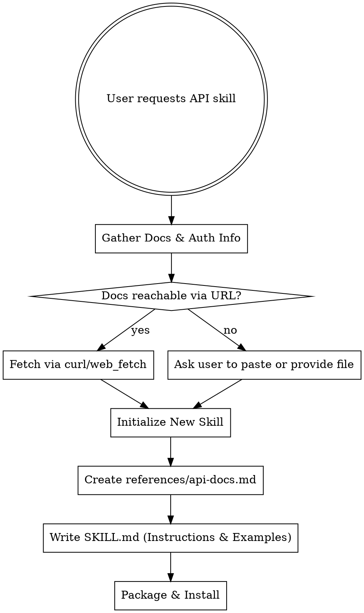

# API Skill Creator

## Overview
This skill guides you through transforming API documentation (whether from an internal wiki, Confluence, auto-generated Swagger/OpenAPI docs, or raw text) into a dedicated, reusable Claude/Gemini skill. This allows the AI agent to fluently interact with the specified internal or external API in future sessions.

## When to Use
- A user says "I have an internal API I want to make a skill for."
- A user provides a link to an API spec or documentation and asks you to "make a skill" for it.
- You need to build a specialized skill to encapsulate complex API authentication, base URLs, and endpoint definitions.

## Workflow Decision Tree



## Step 1: Gather Documentation and Authentication Information
1. **Locate the Documentation**: 
   - If the user provides a URL (e.g., `http://internal-wiki/api`, `http://localhost:8080/swagger.json`), try to fetch it.
   - For web URLs, use `google_web_search` or `web_fetch` if available.
   - For local or internal network URLs, use `run_shell_command` with `curl` or `Invoke-RestMethod` (PowerShell). 
   - If the URL requires authentication (like Confluence or an internal portal), ask the user for an access token or ask them to download the page content as a text/HTML/JSON file and provide the path.
2. **Determine API Authentication**: Ask the user how the API authenticates requests (e.g., Bearer token, Basic Auth, API Key in header `X-API-Key`). Do NOT hardcode secrets in the skill. The skill should instruct the agent to fetch secrets from environment variables (e.g., `$MY_API_KEY` or `$env:MY_API_KEY`).

## Step 2: Initialize the New Skill
1. Determine a descriptive name (e.g., `company-user-api`, `billing-service`).
2. Use the skill initialization script:
   ```bash
   node "C:\Users\yonik\AppData\Roaming\npm\node_modules\@google\gemini-cli\node_modules\@google\gemini-cli-core\dist\src\skills\builtin\skill-creator\scripts\init_skill.cjs" <skill-name> --path <destination-folder>
   ```
   *(Adjust the path to the init script if necessary by using `activate_skill` for `skill-creator` to get the actual path).*

## Step 3: Create API Reference Document
1. Extract the most important endpoints, request/response schemas, and error codes from the fetched documentation.
2. Save this concise, organized documentation into the new skill's `references/api-docs.md` file. Do not just dump the raw HTML/JSON; synthesize it into clean Markdown tables or code blocks that an LLM can easily read.

## Step 4: Write the New SKILL.md
Edit the new skill's `SKILL.md` to include:
- **Frontmatter**: Clear description of when to use the skill (e.g., `description: Use when you need to fetch user data or update billing info using the Internal Billing API.`)
- **Overview**: What the API does.
- **Authentication**: Instructions on how the agent should authenticate. Provide an example command using shell variables.
  ```markdown
  ## Authentication
  Always include the header `-H "Authorization: Bearer $env:BILLING_API_TOKEN"`. Remind the user to set this environment variable if it is missing.
  ```
- **Base URL**: Define the base URL clearly.
- **Reference Pointer**: Tell the agent to read `references/api-docs.md` for endpoint details when they need to make a request.
- **Examples**: Provide 1-2 concrete, ready-to-run examples (e.g., `curl` commands or Python `requests` snippets) to interact with the API.

## Step 5: Package and Install
1. Run the package script on the new skill directory (check `skill-creator` for the exact script path).
   ```bash
   node "C:\Users\yonik\AppData\Roaming\npm\node_modules\@google\gemini-cli\node_modules\@google\gemini-cli-core\dist\src\skills\builtin\skill-creator\scripts\package_skill.cjs" <path/to/skill-folder>
   ```
2. Install the skill:
   ```bash
   gemini skills install <path/to/skill-name.skill> --scope workspace
   ```
3. Inform the user to run `/skills reload` in their CLI.

## Anti-Patterns
- **Do NOT** hardcode API keys or credentials in the skill files. Use environment variables.
- **Do NOT** dump 10,000 lines of raw Swagger JSON into `SKILL.md`. Synthesize it or put the raw text in `references/` if necessary.
- **Do NOT** forget to specify the Base URL.