# Networking Security Suite

## Overview

This skill provides the "Glue Logic" for the networking security toolset. It explains how to transition between
specialized tools (`wireshark-pro`, `networkx`, `scapy`, `log-parsing`, `wireshark-extensions`) to conduct a
comprehensive security investigation.

## Workflow: The Analysis Pipeline

```dot
digraph investigation_pipeline {
    rankdir=LR;
    node [shape=box, style=filled, fillcolor=lightblue];
    
    "Triage" [label="1. Triage & Filter\n(wireshark-pro)"];
    "Topology" [label="2. Topology Mapping\n(networkx)"];
    "DPI" [label="3. Deep Inspection\n(scapy)"];
    "Correlation" [label="4. Log Correlation\n(log-parsing)"];
    "Reverse" [label="5. Protocol Reverse\n(extensions)"];
    
    "Triage" -> "Topology" [label="Cleaned IPs/Edges"];
    "Topology" -> "DPI" [label="Suspicious Nodes"];
    "DPI" -> "Correlation" [label="Timestamps/Alerts"];
    "Correlation" -> "Reverse" [label="Proprietary Triggers"];
    "Reverse" -> "Triage" [label="New Dissectors"];
}
```



## When to Transition

### 1. From `wireshark-pro` to `networkx`

**Trigger:** You have a PCAP filtered down to internal traffic and want to find "Patient Zero" or "Lateral Movement"
hubs.
**Action:** Extract source/destination pairs and load into a Graph.

```bash
# Extract edges
tshark -r filtered.pcap -T fields -e ip.src -e ip.dst > edges.csv
```

### 2. From `networkx` to `scapy`

**Trigger:** Graph analysis shows a specific IP with high `betweenness_centrality` (acting as a bridge).
**Action:** Use Scapy to sniff specifically for that IP or craft a probe to check its services.

```python
# Focus on the 'Bridge' node identified by NetworkX
sniff(filter="host 10.0.0.5", prn=process_packet)
```

### 3. From `scapy`/`wireshark-pro` to `log-parsing`

**Trigger:** You found a packet spike at `2024-04-05 10:23:45`.
**Action:** Parse server logs at that exact timestamp to see which process or user account was active.

```python
# Correlate with logs
df = parse_syslog('auth.log')
potential_culprits = df[df['timestamp'].between('10:23:00', '10:24:00')]
```

### 4. From any tool to `wireshark-extensions`

**Trigger:** You see "Data" or "Malformed" packets that don't match any known protocol.
**Action:** Write a Lua dissector to label the bytes.

## Common Analysis Synergies

| Task                    | Primary Tool                | Secondary (Synergy) Tool                 |
|:------------------------|:----------------------------|:-----------------------------------------|
| **DDoS Detection**      | `wireshark-pro` (pps count) | `networkx` (victim-to-attacker ratio)    |
| **Beaconing Detection** | `tshark` (time delta)       | `scapy` (entropy analysis of payloads)   |
| **Insider Threat**      | `log-parsing` (login times) | `networkx` (unusual node connections)    |
| **Exploit Research**    | `scapy` (packet crafting)   | `wireshark-pro` (validation of response) |

## Red Flags - STOP and Redirect

- **"I'm manually counting IPs in a text file."** -> STOP. Use `networkx` for automated relationship analysis.
- **"I'm guessing what these bytes mean."** -> STOP. Use `wireshark-extensions` to build a dissector.
- **"I'm trying to find a user ID in a PCAP."** -> STOP. PCAPs rarely have IDs; use `log-parsing` on the application
  logs.
- **"The script is hanging on a 2GB file."** -> STOP. Use `wireshark-pro` (`editcap`) to chunk the file first.